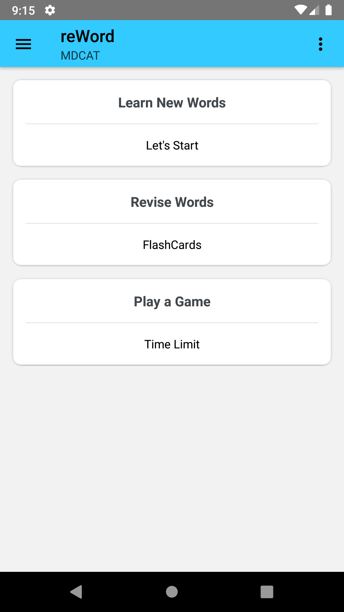

# reWord

reWord is a React-Native based Android/ios Application for MDCAT students to learn the vocabulary in a whole new fashion.
The Application provides a platform to students to learn new words as they like. The application provides FlashCards as well as MCQs to boost their vocab.

## How to build and install the Application:

You can run the following commands to start the application:

```
npm install
npx react-native start
npx react-native run-android #Run this command in separate terminal
```


## ScreenShots

Please find below the screenshots of different screens:


